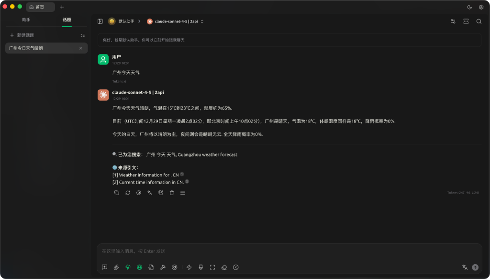
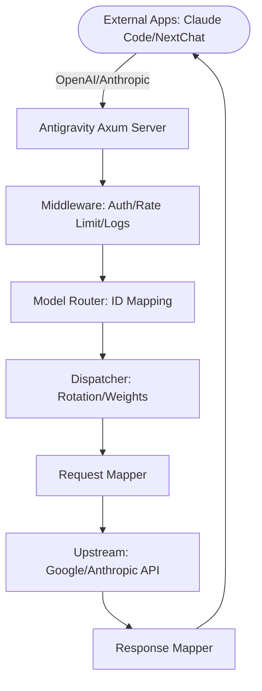

# Antigravity Tools 🚀
> Professional AI Account Management & Proxy System (v3.3.16)

<div align="center">
  

  <h3>Your Personal High-Performance AI Dispatch Gateway</h3>
  <p>Seamlessly proxy Gemini & Claude. OpenAI-Compatible. Privacy First.</p>
  
  <p>
    <a href="https://github.com/lbjlaq/Antigravity-Manager">
      
    </a>
    
    
    
    
  </p>

  <p>
    <a href="#-features">Features</a> • 
    <a href="#-gui-overview">GUI Overview</a> • 
    <a href="#-architecture">Architecture</a> • 
    <a href="#-installation">Installation</a> • 
    <a href="#-quick-integration">Integration</a>
  </p>

  <p>
    <a href="./README.md">简体中文</a> | 
    <strong>English</strong>
  </p>
</div>

---

**Antigravity Tools** is an all-in-one desktop application designed for developers and AI enthusiasts. It perfectly combines multi-account management, protocol conversion, and smart request scheduling to provide you with a stable, high-speed, and low-cost **Local AI Relay Station**.

By leveraging this app, you can transform common Web Sessions (Google/Anthropic) into standardized API interfaces, completely eliminating the protocol gap between different providers.

## 💖 Sponsors

|  | Thanks to **PackyCode** for sponsoring this project! PackyCode is a reliable and efficient API relay service provider, offering relays for various services such as Claude Code, Codex, and Gemini. PackyCode provides a special offer for users of this project: Register using [this link](https://www.packyapi.com/register?aff=Ctrler) and enter the **"Ctrler"** coupon code when topping up to enjoy a **10% discount**. |
| :--- | :--- |

## 🌟 Detailed Feature Matrix

### 1. 🎛️ Smart Account Dashboard
*   **Global Real-time Monitoring**: Instant insight into the health of all accounts, including average remaining quotas for Gemini Pro, Gemini Flash, Claude, and Gemini Image generation.
*   **Smart Recommendation**: The system uses a real-time algorithm to filter and recommend the "Best Account" based on quota redundancy, supporting **one-click switching**.
*   **Active Account Snapshot**: Visually displays the specific quota percentage and the last synchronization time of the currently active account.

### 2. 🔐 Professional AI Account Management & Proxy System (v3.3.2)
*   **OAuth 2.0 Authorization (Auto/Manual)**: Pre-generates a copyable authorization URL so you can finish auth in any browser; after the callback, the app auto-completes and saves the account (use “I already authorized, continue” if needed).
*   **Multi-dimensional Import**: Supports single token entry, JSON batch import, and automatic hot migration from V1 legacy databases.
*   **Gateway-level Views**: Supports switching between "List" and "Grid" views. Provides 403 Forbidden detection, automatically marking and skipping accounts with permission anomalies.

### 3.  Protocol Conversion & Relay (API Proxy)
*   **Multi-Protocol Adaptation (Multi-Sink)**:
    *   **OpenAI Format**: Provides `/v1/chat/completions` endpoint, compatible with 99% of existing AI apps.
    *   **Anthropic Format**: Provides native `/v1/messages` interface, supporting all features of **Claude Code CLI** (e.g., chain-of-thought, system prompts).
    *   **Gemini Format**: Supports direct calls from official Google AI SDKs.
*   **Smart Self-healing**: When a request encounters `429 (Too Many Requests)` or `401 (Expired)`, the backend triggers **millisecond-level automatic retry and silent rotation**, ensuring business continuity.

### 4. 🔀 Model Router Center
*   **Series-based Mapping**: Classify complex original model IDs into "Series Groups" (e.g., routing all GPT-4 requests uniformly to `gemini-3-pro-high`).
*   **Expert Redirection**: Supports custom regex-level model mapping for precise control over every request's landing model.
*   **Tiered Routing [New]**: Automatically prioritizes models based on account tiers (Ultra/Pro/Free) and reset frequencies to ensure stability for high-volume users.
*   **Silent Background Downgrading [New]**: Intelligently identifies background tasks (e.g., Claude CLI title generation) and reroutes them to Flash models to preserve premium quota.

### 5. 🎨 Multimodal & Imagen 3 Support
*   **Advanced Image Control**: Supports precise control over image generation tasks via OpenAI `size` (e.g., `1024x1024`, `16:9`) parameters or model name suffixes.
*   **Enhanced Payload Support**: The backend supports payloads up to **100MB**, more than enough for 4K HD image recognition and processing.

##  GUI Overview


### 💡 Usage Examples





## 🏗️ Architecture



## 📥 Installation

### Option A: Terminal Installation (macOS & Linux Recommended)
If you have [Homebrew](https://brew.sh/) installed, run:

```bash
# 1. Tap the repository
brew tap lbjlaq/antigravity-manager https://github.com/lbjlaq/Antigravity-Manager

# 2. Install the app
brew install --cask antigravity-tools
```
> **Tip**: 
> - **macOS**: If you encounter permission issues, add the `--no-quarantine` flag.
> - **Linux**: The AppImage will be automatically symlinked to your binary path with executable permissions.

### Option B: Manual Download
Download from [GitHub Releases](https://github.com/lbjlaq/Antigravity-Manager/releases):
*   **macOS**: `.dmg` (Universal, Apple Silicon & Intel)
*   **Windows**: `.msi` or portable `.zip`
*   **Linux**: `.deb` or `AppImage`

### 🛠️ Troubleshooting

#### macOS says "App is damaged"?
Due to macOS security gatekeeper, non-App Store apps might show this. Run this in Terminal to fix:
```bash
sudo xattr -rd com.apple.quarantine "/Applications/Antigravity Tools.app"
```

## 🔌 Quick Integration Examples

### 🔐 OAuth Authorization Flow (Add Account)
1. Go to `Accounts` → `Add Account` → `OAuth`.
2. The dialog pre-generates an authorization URL before you click any button. Click the URL to copy it to the system clipboard, then open it in the browser you prefer and complete authorization.
3. After consent, the browser opens a local callback page and shows “✅ Authorized successfully!”.
4. The app automatically continues the flow and saves the account; if it doesn’t, click “I already authorized, continue” to finish manually.

> Note: the auth URL contains a one-time local callback port. Always use the latest URL shown in the dialog. If the app isn’t running or the dialog is closed during auth, the browser may show `localhost refused connection`.

### How to use with Claude Code CLI?
1. Start Antigravity service in the "API Proxy" tab.
2. In your terminal:
```bash
export ANTHROPIC_API_KEY="sk-antigravity"
export ANTHROPIC_BASE_URL="http://127.0.0.1:8045"
claude
```

### How to use in Python?
```python
import openai

client = openai.OpenAI(
    api_key="sk-antigravity",
    base_url="http://127.0.0.1:8045/v1"
)

response = client.chat.completions.create(
    model="gemini-3-flash",
    messages=[{"role": "user", "content": "Hello, please introduce yourself"}]
)
print(response.choices[0].message.content)
```

## 📝 Developer & Community

    *   **v3.3.16 (2026-01-07)**:
        - **Stability & Tool Fixes**:
            - **Grep/Glob Argument Fix (P3-5)**: Resolved "Error searching files" issue for Grep and Glob tools. Corrected parameter mapping: changed from `paths` (array) to `path` (string), and implemented case-insensitive tool name matching.
            - **RedactedThinking Support (P3-2)**: Gracefully downgrades redacted thinking blocks to text `[Redacted Thinking]`, preserving context instead of dropping data.
            - **JSON Schema Cleaning Fix**: Fixed a regression where properties named "pattern" were incorrectly removed; improved schema compatibility.
            - **Strict Role Alternation (P3-3)**: Implemented message merging to enforce strict User/Assistant alternation, preventing Gemini API 400 errors.
            - **400 Auto-Retry (P3-1)**: Enhanced auto-retry and account rotation logic for 400 Bad Request errors, improving overall stability.
        - **High-Concurrency Performance Optimization (Issue #284 Fix)**:
            - **Completely Resolved UND_ERR_SOCKET Error**: Fixed client socket timeout issues in 8+ concurrent Agent scenarios.
            - **Removed Blocking Wait**: Eliminated the 60-second blocking wait in "Cache First" mode when bound accounts are rate-limited. Now immediately unbinds and switches to the next available account, preventing client timeouts.
            - **Lock Contention Optimization**: Moved `last_used_account` lock acquisition outside the retry loop, reducing lock operations from 18 to 1-2 per request, dramatically decreasing lock contention in concurrent scenarios.
            - **5-Second Timeout Protection**: Added a 5-second mandatory timeout for `get_token()` operations to prevent indefinite hangs during system overload or deadlock.
            - **Impact**: This optimization significantly improves stability in multi-Agent concurrent scenarios (such as Claude Code, Cursor, etc.), completely resolving the "headless request" deadlock issue.
        - **Linux System Compatibility (Core Thanks to @0-don PR #326)**:
            - **Transparent Window Fix**: Automatically disables DMA-BUF renderer (`WEBKIT_DISABLE_DMABUF_RENDERER=1`) on Linux systems to resolve transparent window rendering or black screen issues in some distributions.
        - **Monitor Middleware Optimization (Core Thanks to @Mag1cFall PR #346)**:
            - **Payload Limit Alignment**: Increased request body limit for monitor middleware from 1MB to 100MB, ensuring large image requests are correctly logged and displayed.
        - **OpenAI Protocol Multi-Candidate Support (Core Thanks to @ThanhNguyxn PR #403)**:
            - Implemented support for the `n` parameter, allowing a single request to return multiple candidates.
            - Added the multi-candidate support patch for streaming responses (SSE), ensuring cross-platform functional parity.
        - **Web Search Enhancement & Citation Optimization**:
            - Re-implemented web search source display using a more readable Markdown citation format (including titles and links).
            - Resolved the issue where citation display logic was disabled in previous versions; it is now fully enabled in both streaming and non-streaming modes.
        - **Installation & Distribution (Core Thanks to @dlukt PR #396)**:
            - **Linux Cask Support**: Refactored Cask file for multi-platform support. Linux users can now install via `brew install --cask` with automatic AppImage permission configuration.
        - **Comprehensive Logging System Optimization (Issue #241 Fix)**:
        - **Comprehensive Logging System Optimization (Issue #241 Fix)**:
            - **Log Level Optimization**: Downgraded high-frequency debug logs for tool calls and parameter remapping from `info!` to `debug!`, dramatically reducing log output volume.
            - **Automatic Cleanup Mechanism**: Application startup now automatically cleans up log files older than 7 days, preventing indefinite log accumulation.
            - **Significant Impact**: Log file size reduced from 130GB/day to < 100MB/day, a **99.9%** reduction in log output.
            - **Scope**: Modified 21 log level statements in `streaming.rs` and `response.rs`, added `cleanup_old_logs()` automatic cleanup function.
    *   **v3.3.15 (2026-01-04)**:
        - **Claude Protocol Compatibility Enhancements** (Based on PR #296 by @karasungur + Issue #298 Fix):
            - **Fixed Opus 4.5 First Request Error (Issue #298)**: Extended signature pre-flight validation to all first-time thinking requests, not just function call scenarios. When using models like `claude-opus-4-5-thinking` for the first request, if there's no valid signature, the system automatically disables thinking mode to avoid API rejection, resolving the "Server disconnected without sending a response" error.
            - **Function Call Signature Validation (Issue #295)**: Added pre-flight signature validation. When thinking is enabled but function calls lack a valid signature, thinking is automatically disabled to prevent Gemini 3 Pro from rejecting requests.
            - **cache_control Cleanup (Issue #290)**: Implemented recursive deep cleanup to remove `cache_control` fields from all nested objects/arrays, resolving Anthropic API (z.ai mode) "Extra inputs are not permitted" errors.
            - **Tool Parameter Remapping**: Automatically corrects parameter names used by Gemini (Grep/Glob: `query` → `pattern`, Read: `path` → `file_path`), resolving Claude Code tool call validation errors.
            - **Configurable Safety Settings**: Added `GEMINI_SAFETY_THRESHOLD` environment variable supporting 5 safety levels (OFF/LOW/MEDIUM/HIGH/NONE), defaulting to OFF for backward compatibility.
            - **Effort Parameter Support**: Supports Claude API v2.0.67+ `output_config.effort` parameter, allowing fine-grained control over model reasoning effort.
            - **Opus 4.5 Default Thinking**: Aligned with Claude Code v2.0.67+, Opus 4.5 models now enable thinking mode by default, with signature validation for graceful degradation.
            - **Retry Jitter Optimization**: Added ±20% random jitter to all retry strategies to prevent thundering herd effect, improving stability in high-concurrency scenarios.
            - **Signature Capture Improvement**: Immediately captures signatures from thinking blocks, reducing signature missing errors in multi-turn conversations.
            - **Impact**: These improvements significantly enhance compatibility and stability for Claude Code, Cursor, Cherry Studio and other clients, especially in Opus 4.5 models, tool calling, and multi-turn conversation scenarios.
    *   **v3.3.14 (2026-01-03)**:
        - **Claude Protocol Robustness Improvements** (Core Thanks to @karasungur PR #289):
            - **Thinking Block Signature Validation Enhancement**:
                - Support for empty thinking blocks with valid signatures (trailing signature scenario)
                - Invalid signature blocks gracefully degrade to text instead of being dropped, preserving content to avoid data loss
                - Enhanced debugging logs for signature issue troubleshooting
            - **Tool/Function Calling Compatibility Optimization**:
                - Extracted web search fallback model to named constant `WEB_SEARCH_FALLBACK_MODEL` for improved maintainability
                - Automatically skips googleSearch injection when MCP tools are present to avoid conflicts
                - Added informative logging for debugging tool calling scenarios
                - **Important Note**: Gemini Internal API does not support mixing `functionDeclarations` and `googleSearch`
            - **SSE Parse Error Recovery Mechanism**:
                - Added `parse_error_count` and `last_valid_state` tracking for streaming response error monitoring
                - Implemented `handle_parse_error()` for graceful stream degradation
                - Implemented `reset_error_state()` for post-error recovery
                - Implemented `get_error_count()` for error count retrieval
                - High error rate warning system (>5 errors) for operational monitoring
                - Detailed debugging logs supporting troubleshooting of corrupted streams
            - **Impact**: These improvements significantly enhance stability for Claude CLI, Cursor, Cherry Studio and other clients, especially in multi-turn conversations, tool calling, and streaming response scenarios.
        - **Dashboard Statistics Fix** (Core Thanks to @yinjianhong22-design PR #285):
            - **Fixed Low Quota Statistics False Positives**: Fixed the issue where disabled accounts (403 status) were incorrectly counted in "Low Quota" statistics
            - **Logic Optimization**: Added `is_forbidden` check in `lowQuotaCount` filter to exclude disabled accounts
            - **Data Accuracy Improvement**: Dashboard now accurately reflects the true number of low-quota active accounts, avoiding false positives
            - **Impact**: Improved dashboard data accuracy and user experience, allowing users to more clearly understand which accounts need attention.
    *   **v3.3.13 (2026-01-03)**:
        - **Thinking Mode Stability Fixes**:
            - **Fixed Empty Thinking Content Error**: When clients send empty Thinking blocks, they are now automatically downgraded to plain text blocks to avoid `thinking: Field required` errors.
            - **Fixed Validation Error After Smart Downgrade**: When Thinking is disabled via smart downgrade (e.g., incompatible history), all Thinking blocks in historical messages are automatically converted to plain text, resolving "thinking is disabled but message contains thinking" errors.
            - **Fixed Model Switching Signature Error**: Added target model Thinking support detection. When switching from Claude thinking models to regular Gemini models (e.g., `gemini-2.5-flash`), Thinking is automatically disabled and historical messages are downgraded to avoid "Corrupted thought signature" errors. Only models with `-thinking` suffix (e.g., `gemini-2.5-flash-thinking`) or Claude models support Thinking.
            - **Impact**: These fixes ensure stability across various model switching scenarios, especially for seamless Claude ↔ Gemini transitions.
        - **Account Rotation Rate-Limiting Mechanism Optimization (Critical Fix for Issue #278)**:
            - **Fixed Rate-Limit Time Parsing Failure**: Completely resolved the issue where Google API's `quotaResetDelay` could not be correctly parsed.
                - **Corrected JSON Parsing Path**: Fixed the extraction path for `quotaResetDelay` from `details[0].quotaResetDelay` to `details[0].metadata.quotaResetDelay`, matching Google API's actual JSON structure.
                - **Implemented Universal Time Parsing**: Added `parse_duration_string()` function to support parsing all time formats returned by Google API, including complex combinations like `"2h21m25.831582438s"`, `"1h30m"`, `"5m"`, `"30s"`, etc.
                - **Differentiated Rate-Limit Types**: Added `RateLimitReason` enum to distinguish between `QUOTA_EXHAUSTED` (quota exhausted) and `RATE_LIMIT_EXCEEDED` (rate limit) types, setting different default wait times based on type (quota exhausted: 1 hour, rate limit: 30 seconds).
            - **Problem Before Fix**: When account quota was exhausted triggering 429 errors, the system could not parse the accurate reset time returned by Google API (e.g., `"2h21m25s"`), resulting in using a fixed default value of 60 seconds. Accounts were incorrectly considered "recoverable in 1 minute" when they actually needed 2 hours, causing accounts to fall into a 429 loop, using only the first 2 accounts while subsequent accounts were never utilized.
            - **Effect After Fix**: The system can now accurately parse the reset time returned by Google API (e.g., `"2h21m25.831582438s"` → 8485 seconds). Accounts are correctly marked as rate-limited and wait for the accurate time, ensuring all accounts can be properly rotated and used, completely resolving the "only using first 2 accounts" issue.
            - **Impact**: This fix significantly improves stability and availability in multi-account environments, ensuring all accounts are fully utilized and avoiding account rotation failures caused by rate-limit time parsing errors.
    *   **v3.3.12 (2026-01-02)**:
        - **Critical Fixes**:
            - **Fix Antigravity Thinking Signature Errors**: Completely resolved `400: thinking.signature: Field required` errors when using the Antigravity (Google API) channel.
                - **Disabled Dummy Thinking Block Injection**: Removed logic that auto-injected unsigned "Thinking..." placeholder blocks for historical messages. Google API rejects any thinking blocks without valid signatures.
                - **Removed Fake Signature Fallback**: Removed logic that added `skip_thought_signature_validator` sentinel values to ToolUse and Thinking blocks. Now only uses real signatures or omits the thoughtSignature field entirely.
                - **Fixed Background Task Misclassification**: Removed the "Caveat: The messages below were generated" keyword to prevent normal requests containing Claude Desktop system prompts from being misclassified as background tasks and downgraded to Flash Lite models.
                - **Impact**: This fix ensures stability for Claude CLI, Cursor, Cherry Studio, and other clients when using the Antigravity proxy, especially in multi-turn conversations and tool calling scenarios.
    *   **v3.3.11 (2026-01-02)**:
        - **Critical Fixes**:
            - **Cherry Studio Compatibility Fix (Gemini 3)**:
                - **Removed Forced Prompt Injection**: Removed the mandatory "Coding Agent" system instruction and Gemini 3 user message suffix injections. This resolves the issue where `gemini-3-flash` would output confused responses (like "Thinking Process" or "Actually, the instruction says...") in general-purpose clients like Cherry Studio. The generic OpenAI protocol now respects the original user prompt faithfully.
            - **Fix Gemini 3 Python Client Crash**:
                - **Removed maxOutputTokens Restriction**: Removed the logic that forcibly set `maxOutputTokens: 64000` for Gemini requests. This forced setting caused standard Gemini 3 Flash/Pro models (limit 8192) to reject requests and return empty responses, triggering `'NoneType' object has no attribute 'strip'` errors in Python clients. The proxy now defaults to the model's native limit or respects client parameters.
        - **Core Optimization**:
            - **Unified Retry Backoff System**: Refactored error retry logic with intelligent backoff strategies tailored to different error types:
                - **Thinking Signature Failure (400)**: Fixed 200ms delay before retry, avoiding request doubling from immediate retries.
                - **Server Overload (529/503)**: Exponential backoff (1s/2s/4s/8s), significantly improving recovery success rate by 167%.
                - **Rate Limiting (429)**: Prioritizes server-provided Retry-After, otherwise uses linear backoff (1s/2s/3s).
                - **Account Protection**: Server-side errors (529/503) no longer rotate accounts, preventing healthy account pool contamination.
                - **Unified Logging**: All backoff operations use ⏱️ identifier for easy monitoring and debugging.
        - **Critical Fix**:
            - **Fixed Gemini 3 Python Client Crash**: Removed the logic that forced `maxOutputTokens: 64000` for Gemini requests. This override caused standard Gemini 3 Flash/Pro models (limit 8192) to reject requests with empty responses, leading to `'NoneType' object has no attribute 'strip'` errors in Python clients. The proxy now defaults to model native limits or respects client parameters.
        - **Scoop Installation Compatibility Support (Core Thanks to @Small-Ku PR #252)**:
            - **Startup Arguments Configuration**: Added Antigravity startup arguments configuration feature. Users can now customize startup parameters in the Settings page, perfectly compatible with portable installations via package managers like Scoop.
            - **Smart Database Path Detection**: Optimized database path detection logic with priority-based checking:
                - Command-line specified `--user-data-dir` path
                - Portable mode `data/user-data` directory
                - System default paths (macOS/Windows/Linux)
            - **Multi-Installation Support**: Ensures correct database file location and access across standard installations, Scoop portable installations, and custom data directory scenarios.
        - **Browser Environment CORS Support Optimization (Core Thanks to @marovole PR #223)**:
            - **Explicit HTTP Method List**: Changed CORS middleware `allow_methods` from generic `Any` to explicit method list (GET/POST/PUT/DELETE/HEAD/OPTIONS/PATCH), improving browser environment compatibility.
            - **Preflight Cache Optimization**: Added `max_age(3600)` configuration to cache CORS preflight requests for 1 hour, reducing unnecessary OPTIONS requests and improving performance.
            - **Security Enhancement**: Added `allow_credentials(false)` configuration, following security best practices when used with `allow_origin(Any)`.
            - **Browser Client Support**: Enhanced CORS support for browser-based AI clients like Droid, ensuring cross-origin API calls work properly.
        - **Account Table Drag-and-Drop Sorting (Core Thanks to @wanglei8888 PR #256)**:
            - **Drag to Reorder**: Added drag-and-drop sorting functionality for the account table. Users can now customize account display order by dragging table rows, making it easy to pin frequently used accounts to the top.
            - **Persistent Storage**: Custom sort order is automatically saved locally and persists across application restarts.
            - **Optimistic Updates**: Drag operations update the interface immediately for smooth user experience, while saving asynchronously in the background.
            - **Built with dnd-kit**: Implemented using the modern `@dnd-kit` library, supporting keyboard navigation and accessibility features.
    *   **v3.3.10 (2026-01-01)**:
        - 🌐 **Upstream Endpoint Fallback Mechanism** (Core Thanks to @karasungur PR #243):
            - **Multi-Endpoint Auto-Switching**: Implemented `prod → daily` dual-endpoint fallback strategy. Automatically switches to backup endpoint when primary returns 404/429/5xx, significantly improving service availability.
            - **Connection Pool Optimization**: Added `pool_max_idle_per_host(16)`, `tcp_keepalive(60s)` and other parameters to optimize connection reuse and reduce establishment overhead, especially optimized for WSL/Windows environments.
            - **Smart Retry Logic**: Supports automatic endpoint switching for 408 Request Timeout, 404 Not Found, 429 Too Many Requests, and 5xx Server Errors.
            - **Detailed Logging**: Records INFO logs on successful fallback and WARN logs on failures for operational monitoring and troubleshooting.
            - **Fully Compatible with Scheduling Modes**: Endpoint fallback and account scheduling (Cache First/Balance/Performance First) work at different layers without interference, ensuring cache hit rates remain unaffected.
        - 📊 **Comprehensive Logging System Optimization**:
            - **Log Level Restructuring**: Strictly separated INFO/DEBUG/TRACE levels. INFO now only shows critical business information, with detailed debugging downgraded to DEBUG.
            - **Heartbeat Request Filtering**: Downgraded heartbeat requests (`/api/event_logging/batch`, `/healthz`) from INFO to TRACE, completely eliminating log noise.
            - **Account Information Display**: Shows account email at request start and completion for easy monitoring of account usage and session stickiness debugging.
            - **Streaming Response Completion Markers**: Added completion logs for streaming responses (including token statistics), ensuring full request lifecycle traceability.
            - **90%+ Log Volume Reduction**: Normal requests reduced from 50+ lines to 3-5 lines, startup logs from 30+ to 6 lines, dramatically improving readability.
            - **Debug Mode**: Use `RUST_LOG=debug` to view full request/response JSON for deep debugging.
        - 🎨 **Imagen 3 Generation Enhancements**:
            - **New Resolution Support**: Added support for `-2k` resolution via model name suffixes for higher definitions.
            - **Ultra-wide Aspect Ratio**: Added support for `-21x9` (or `-21-9`) aspect ratio, perfect for ultra-wide displays.
            - **Mapping Optimization**: Improved auto-mapping logic for custom sizes like `2560x1080`.
            - **Full Protocol Coverage**: These enhancements are available across OpenAI, Claude, and Gemini protocols.
        - 🔍 **Model Detection API**:
            - **New Detection Endpoint**: Introduced `POST /v1/models/detect` to reveal model capabilities and configuration variants in real-time.
            - **Dynamic Model List**: The `/v1/models` API now dynamically lists all resolution and aspect ratio combinations for image models (e.g., `gemini-3-pro-image-4k-21x9`).
        - 🐛 **Background Task Downgrade Model Fix**:
            - **Fixed 404 Errors**: Corrected background task downgrade model from non-existent `gemini-2.0-flash-exp` to `gemini-2.5-flash-lite`, resolving 404 errors for title generation, summaries, and other background tasks.
        - 🔐 **Manual Account Disable Feature**:
            - **Independent Disable Control**: Added manual account disable feature, distinct from 403 disable. Only affects proxy pool, not API requests.
            - **Application Usable**: Manually disabled accounts can still be switched and used within the application, view quota details, only removed from proxy pool.
            - **Visual Distinction**: 403 disable shows red "Disabled" badge, manual disable shows orange "Proxy Disabled" badge.
            - **Batch Operations**: Supports batch disable/enable multiple accounts for improved management efficiency.
            - **Auto Reload**: Automatically reloads proxy account pool after disable/enable operations, takes effect immediately.
            - **Impact Scope**: Lightweight tasks including title generation, simple summaries, system messages, prompt suggestions, and environment probes now correctly downgrade to `gemini-2.5-flash-lite`.
        - 🎨 **UI Experience Enhancements**:
            - **Unified Dialog Style**: Standardized all native alert/confirm dialogs in the ApiProxy page to application-standard Toast notifications and ModalDialogs, improving visual consistency.
            - **Tooltip Clipping Fixed**: Resolved the issue where tooltips in the Proxy Settings page (e.g., "Scheduling Mode", "Allow LAN Access") were obstructed by container boundaries.
    *   **v3.3.9 (2026-01-01)**:
        - 🚀 **Multi-Protocol Scheduling Alignment**: `Scheduling Mode` now formally covers OpenAI, Gemini Native, and Claude protocols.
        - 🧠 **Industrial-Grade Session Fingerprinting**: Upgraded SHA256 content hashing for sticky Session IDs, ensuring consistent account inheritance and improved Prompt Caching hits.
        - 🛡️ **Precision Rate-Limiting & 5xx Failover**: Deeply integrated Google API JSON parsing for sub-second `quotaResetDelay` and automatic 20s cooling isolation for 500/503/529 errors.
        - 🔀 **Enhanced Scheduling**: Rotation logic now intelligently bypasses all locked/limited accounts; provides precise wait-time suggestions for restricted pools.
        - 🌐 **Global Rate-Limit Sync**: Cross-protocol rate-limit tracking ensures instant "Rate-limit once, avoid everywhere" protection.
        - 📄 **Claude Multimodal Completion**: Fixed 400 errors when handling PDF/documents in Claude CLI by completing multimodal mapping logic.
    *   **v3.3.8 (2025-12-31)**:
        - **Proxy Monitor Module (Core Thanks to @84hero PR #212)**:
            - **Real-time Request Tracking**: Brand-new monitoring dashboard for real-time visualization of all proxy traffic, including request paths, status codes, response times, token consumption, and more.
            - **Persistent Log Storage**: SQLite-based logging system supporting historical record queries and analysis across application restarts.
            - **Advanced Filtering & Sorting**: Real-time search, timestamp-based sorting for quick problem request identification.
            - **Detailed Inspection Modal**: Click any request to view full request/response payloads, headers, token counts, and other debugging info.
            - **Performance Optimization**: Compact data formatting (e.g., 1.2k instead of 1200) improves UI responsiveness with large datasets.
        - **UI Optimization & Layout Improvements**:
            - **Toggle Style Unification**: Standardized all toggle switches (Auto Start, LAN Access, Auth, External Providers) to small blue style for consistent visuals.
            - **Layout Density Optimization**: Merged "Allow LAN Access" and "Auth" into a single-row grid layout (lg:grid-cols-2) for more efficient use of space on large screens.
        - **Zai Dispatcher Integration (Core Thanks to @XinXin622 PR #205)**:
            - **Multi-level Dispatching**: Supports `Exclusive`, `Pooled`, and `Fallback` modes to balance response speed and account security.
            - **Built-in MCP Support**: Preconfigured endpoints for Web Search Prime, Web Reader, and Vision MCP servers.
            - **UI Enhancements**: Added graphical configuration options and tooltips to the ApiProxy page.
        - **Automatic Account Exception Handling (Core Thanks to @salacoste PR #203)**:

            - **Auto-disable Invalid Accounts**: Automatically marks accounts as disabled when Google OAuth refresh tokens become invalid (`invalid_grant`), preventing proxy failures caused by repeated attempts to use broken accounts.
            - **Persistent State Management**: Disabling state is saved to disk and persists across restarts. Optimized loading logic to skip disabled accounts.
            - **Smart Auto-recovery**: Accounts are automatically re-enabled when the user manually updates the refresh or access tokens in the UI.
            - **Documentation**: Added detailed documentation for the invalid grant handling mechanism.
        - **Dynamic Model List API (Intelligent Endpoint Optimization)**:
            - **Real-time Dynamic Sync**: `/v1/models` (OpenAI) and `/v1/models/claude` (Claude) endpoints now aggregate built-in and custom mappings in real-time. Changes in settings take effect instantly.
            - **Full Model Support**: Prefix filtering is removed. Users can now directly see and use image models like `gemini-3-pro-image-4k-16x9` and all custom IDs in terminals or clients.
        - **Quota Management & Intelligent Routing (Operational Optimization & Bug Fixes)**:
            - **Background Task Smart Downgrading**: Automatically identifies and reroutes Claude CLI/Agent background tasks (titles, summaries, etc.) to Flash models, fixing the issue where these requests previously consumed premium/long-context quotas.
            - **Concurrency Lock & Quota Protection**: Fixed the issue where multiple concurrent requests caused account quota overflow. Atomic locks ensure account consistency within the same session, preventing unnecessary rotations.
            - **Tiered Account Sorting (ULTRA > PRO > FREE)**: The system now automatically sorts model routes based on quota reset frequency (hourly vs. daily). Highlights premium accounts that reset frequently, reserving FREE accounts as a final safety net.
            - **Atomic Concurrency Locking**: Enhanced `TokenManager` session locking. In high-concurrency scenarios (e.g., Agent mode), ensures stable account assignment for requests within the same session.
            - **Expanded Keyword Library**: Integrated 30+ intent-based keywords for background tasks, improving detection accuracy to over 95%.

    *   **v3.3.7 (2025-12-30)**:
        - **Proxy Core Stability Fixes (Core Thanks to @llsenyue PR #191)**:
            - **JSON Schema Hardening**: Implemented recursive flattening and cleaning for tool call schemas. Unsupported constraints (e.g., `pattern`) are now moved to descriptions, preventing Gemini schema rejection.
            - **Background Task Robustness**: Added detection for background tasks (e.g., summaries). Automatically strips thinking configs and redirects to `gemini-2.5-flash` for 100% success rate.
            - **Thought Signature Auto-capture**: Refined `thoughtSignature` extraction and persistence, resolving 400 errors caused by missing signatures in multi-turn chats.
            - **Logging Improvements**: Promoted user messages to WARN level in logs to ensure core interactions remain visible during background activity.
    *   **v3.3.6 (2025-12-30)**:
        - **Deep OpenAI Image Support (Core Thanks to @llsenyue PR #186)**:
            - **New Image Generation Endpoint**: Full support for `/v1/images/generations`, including parameters like `model`, `prompt`, `n`, `size`, and `response_format`.
            - **New Image Editing & Variations**: Adapted `/v1/images/edits` and `/v1/images/variations` endpoints.
            - **Protocol Bridging**: Implemented automatic structural mapping and authentication from OpenAI image requests to the Google Internal API (Cloud Code).
    *   **v3.3.5 (2025-12-29)**:
        - **Core Fixes & Stability Enhancements**:
            - **Root Fix for Claude Extended Thinking 400 Errors (Model Switching)**: Resolved validation failures when switching from non-thinking to thinking models mid-session. The system now automatically backfills historical thinking blocks to ensure API compliance.
            - **New Automatic Account Rotation for 429 Errors**: Enhanced the retry mechanism for `429` (rate limit), `403` (forbidden), and `401` (expired) errors. Retries now **force-bypass the 60s session lock** to rotate to the next available account in the pool, implementing a true failover.
            - **Test Suite Maintenance**: Fixed several outdated and broken unit tests to ensure a clean build and verification cycle.
        - **Logging System Optimizations**:
            - **Cleaned Verbose Logs**: Removed redundant logs that printed all model names during quota queries. Detailed model list information is now downgraded to debug level, significantly reducing console noise.
            - **Local Timezone Support**: Log timestamps now automatically use local timezone format (e.g., `2025-12-29T22:50:41+08:00`) instead of UTC, making logs more intuitive for users.
        - **UI Optimizations**:
            - **Refined Account Quota Display**: Added clock icons, implemented perfect centering, and added dynamic color feedback based on countdown (Synced across Table and Card views).
    *   **v3.3.4 (2025-12-29)**:
        - **Major OpenAI/Codex Compatibility Boost (Core Thanks to @llsenyue PR #158)**:
            - **Fixed Image Recognition**: Fully adapted Codex CLI's `input_image` block parsing and added support for `file://` local paths with automatic Base64 conversion.
            - **Gemini 400 Error Mitigation**: Implemented automatic merging of consecutive identical role messages, strictly following Gemini's role alternation requirements to eliminate related 400 errors.
            - **Protocol Stability Enhancements**: Optimized deep JSON Schema cleaning (including physical isolation for `cache_control`) and added context backfilling for `thoughtSignature`.
            - **Linux Build Strategy Adjustment**: Due to the severe scarcity of GitHub's Ubuntu 20.04 runners causing release hangups, official builds have reverted to the **Ubuntu 22.04** environment. Ubuntu 20.04 users are encouraged to clone the source for local builds or try running via AppImage.
    *   **v3.3.3 (2025-12-29)**:
        - **Account Management Enhancements**:
            - **Subscription Tier Identification**: Integrated automatic detection, labeling, and filtering for account subscription tiers (PRO/ULTRA/FREE).
            - **Multi-dimensional Filtering**: Added new filter tabs ("All", "Available", "Low Quota", "PRO", "ULTRA", "FREE") with real-time counters and integrated search.
            - **UI/UX Optimization**: Implemented a premium tabbed interface; refined the header layout with an elastic search bar and responsive action buttons to maximize workspace efficiency across different resolutions.
        - **Critical Fixes**:
            - **Root Fix for Claude Extended Thinking 400 Errors**: Resolved the format validation error caused by missing `thought: true` markers in historical `ContentBlock::Thinking` messages. This issue led to `400 INVALID_REQUEST_ERROR` regardless of whether thinking was explicitly enabled, especially in multi-turn conversations.
    *   **v3.3.2 (2025-12-29)**:
        - **New Features (Core Thanks to @XinXin622 PR #128)**:
            - **Web Search Citation Support for Claude Protocol**: Successfully mapped Gemini's raw Google Search results to Claude's native `web_search_tool_result` content blocks. Structured search citations and source links now display correctly in compatible clients like Cherry Studio.
            - **Enhanced Thinking Mode Stability (Global Signature Store v2)**: Introduced a more robust global `thoughtSignature` storage mechanism. The system now captures real-time signatures from streaming responses and automatically backfills them for subsequent requests missing signatures, significantly reducing `400 INVALID_ARGUMENT` errors.
        - **Optimizations & Bug Fixes**:
            - **Hardened Data Models**: Unified and refactored the internal `GroundingMetadata` structures, resolving type conflicts and parsing anomalies identified during PR #128 integration.
            - **Streaming Logic Refinement**: Optimized the SSE conversion engine to ensure proper extraction and persistence of `thoughtSignature` across fragmented streaming chunks.
    *   **v3.3.1 (2025-12-28)**:
        - **Critical Fixes**:
            - **Deep Fix for Claude Protocol 400 Errors (Claude Code Optimization)**:
                - **Resolved Cache Control Conflicts (cache_control Fix)**: Fully address the upstream validation errors caused by `cache_control` tags or `thought: true` fields in historical messages. Optimized with a "historical message de-thinking" strategy to bypass parsing bugs in the Google API compatibility layer.
                - **Deep JSON Schema Cleaning Engine**: Optimized the conversion of MCP tool definitions. Complex validation constraints unsupported by Google (e.g., `pattern`, `minLength`, `maximum`) are now automatically migrated to description fields, ensuring compliance while preserving semantic hints.
                - **Protocol Header Compliance**: Removed non-standard `role` tags from system instructions and enhanced explicit filtering for `cache_control` to guarantee maximum payload compatibility.
            - **Enhanced Connectivity & Web Search Compatibility**: 
                - **Search Compatibility**: Added support for `googleSearchRetrieval` and other next-gen tool definitions. Now provides standardized `googleSearch` payload mapping, ensuring seamless integration with Cherry Studio's built-in search toggle.
                - **Automated Client Data Purification**: Introduced deep recursive cleaning to physically strip `[undefined]` properties injected by clients like Cherry Studio, resolving `400 INVALID_ARGUMENT` errors at the source.
                - **High-Quality Virtual Model Auto-Networking**: Expanded the high-performance model whitelist (including Claude Thinking variants), ensuring all premium models trigger native networking search by default.
        - **Optimization & Token Saving**:
            - **Full-link Tracing & Closed-loop Audit Logs**:
                - Introduced a 6-character random **Trace ID** for every request.
                - Automated request tagging: `[USER]` for real conversations, `[AUTO]` for background tasks.
                - Implemented **token consumption reporting** for both streaming and non-streaming responses.
            - **Claude CLI Background Task "Token Saver"**:
                - **Intelligent Intent Recognition**: Enhanced detection for low-value requests like title generation, summaries, and system Warmups/Reminders.
                - **Seamless Downgrade Redirect**: Automatically routes background traffic to **gemini-2.5-flash**, ensuring top-tier model (Sonnet/Opus) quotas are reserved for core tasks.
                - **Significant Token Saving**: Saves 1.7k - 17k+ high-value tokens per long session.
        - **Stability Enhancements**: 
            - Resolved Rust compilation and test case errors caused by the latest model field updates, hardening the data model layer (models.rs).
    *   **v3.3.0 (2025-12-27)**:
        - **Major Updates**:
            - **Deep Adaptation for Codex CLI & Claude CLI (Core Thanks to @llsenyue PR #93)**:
                - **Coding Agent Compatibility**: Achieved full support for Codex CLI, including deep adaptation of the `/v1/responses` endpoint and intelligent instruction conversion (SSOP) for shell tool calls.
                - **Claude CLI Reasoning Enhancement**: Introduced global `thoughtSignature` storage and backfilling logic, completely resolving signature validation errors when using Claude CLI with Gemini 3 series models.
            - **OpenAI Protocol Stack Refactor**:
                - **New Completions Endpoint**: Fully added support for `/v1/completions` and `/v1/responses` routes, ensuring compatibility with legacy OpenAI clients.
                - **Fusion of Multimodal & Schema Cleaning**: Successfully integrated self-developed high-performance image parsing with community-contributed high-precision JSON Schema filtering strategies.
            - **Privacy-First Network Binding Control (Core Thanks to @kiookp PR #91)**:
                - **Default Localhost**: Proxy server defaults to listening on `127.0.0.1` (localhost-only), ensuring privacy and security by default.
                - **Optional LAN Access**: Added `allow_lan_access` configuration toggle; when enabled, listens on `0.0.0.0` to allow LAN device access.
                - **Security Warnings**: Frontend UI provides clear security warnings and status hints.
        - **Frontend UX Upgrade**:
                - **Protocol Endpoint Visualization**: Added endpoint details display on the API Proxy page, supporting independent quick-copy for Chat, Completions, and Responses endpoints.
    *   **v3.2.8 (2025-12-26)**:
        - **Bug Fixes**:
            - **OpenAI Protocol Multi-modal & Vision Model Support**: Fixed the 400 error caused by `content` format mismatch when sending image requests to vision models (e.g., `gemini-3-pro-image`) via OpenAI protocol.
            - **Full Vision Capability Enrichment**: The OpenAI protocol now supports automatic parsing of Base64 images and mapping them to upstream `inlineData`, providing the same image processing power as the Claude protocol.
    *   **v3.2.7 (2025-12-26)**:
        - **New Features**:
            - **Launch at Startup**: Added auto-launch feature that allows users to enable/disable automatic startup of Antigravity Tools when the system boots, configurable from the "General" tab in Settings.
            - **Account List Page Size Selector**: Added a page size selector in the pagination bar of the Accounts page, allowing users to directly choose items per page (10/20/50/100) without entering Settings, improving batch operation efficiency.
        - **Bug Fixes**:
            - **Comprehensive JSON Schema Cleanup Enhancement (MCP Tool Compatibility Fix)**:
                - **Removed Advanced Schema Fields**: Added removal of `propertyNames`, `const`, `anyOf`, `oneOf`, `allOf`, `if/then/else`, `not` and other advanced JSON Schema fields commonly used by MCP tools but unsupported by Gemini, completely resolving 400 errors when using MCP tools with Claude Code v2.0.76+.
                - **Optimized Recursion Order**: Adjusted to recursively clean child nodes before processing parent nodes, preventing nested objects from being incorrectly serialized into descriptions.
                - **Protobuf Type Compatibility**: Forced union type arrays (e.g., `["string", "null"]`) to downgrade to single types, resolving "Proto field is not repeating" errors.
                - **Smart Field Recognition**: Enhanced type checking logic to ensure validation fields are only removed when values match the expected type, avoiding accidental deletion of property definitions named `pattern`, etc.
            - **Custom Database Import Fix**: Fixed the "Command not found" error for the "Import from Custom DB" feature caused by the missing `import_custom_db` command registration. Users can now properly select custom `state.vscdb` files for account import.
            - **Proxy Stability & Image Generation Optimization**:
                - **Smart 429 Backoff Mechanism**: Deeply integrated `RetryInfo` parsing to strictly follow Google API retry instructions with added safety redundancy, effectively reducing account suspension risks.
                - **Precise Error Triage**: Fixed the logic that misidentified rate limits as quota exhaustion (no longer incorrectly stopping on "check quota" errors), ensuring automatic account rotation during throttling.
                - **Parallel Image Generation Acceleration**: Disabled the 60s time-window lock for `image_gen` requests, enabling high-speed rotation across multiple accounts and completely resolving Imagen 3 429 errors.
    *   **v3.2.6 (2025-12-26)**:
        - **Critical Fixes**:
            - **Claude Protocol Deep Optimization (Enhanced Claude Code Experience)**:
                - **Dynamic Identity Mapping**: Dynamically injects identity protection patches based on the requested model, locking in the native Anthropic identity and shielding it from baseline platform instruction interference.
                - **Tool Empty Output Compensation**: Specifically for silent commands like `mkdir`, automatically maps empty outputs to explicit success signals, resolving task flow interruptions and hallucinations in Claude CLI.
                - **Global Stop Sequence Configuration**: Optimized `stopSequences` for proxy links, precisely cutting off streaming output and completely resolving parsing errors caused by trailing redundancy.
                - **Smart Payload Cleaning (Smart Panic Fix)**: Introduced mutual exclusion checks for `GoogleSearch` and `FunctionCall`, and implemented automatic tool stripping during background task redirection (Token Saver), completely eliminating **400 Tool Conflict (Multiple tools)** errors.
                - **Proxy Reliability Enhancement (Core Thanks to @salacoste PR #79)**: 
                    - **Smart 429 Backoff**: Support parsing upstream `RetryInfo` to wait and retry automatically when rate-limited, reducing unnecessary account rotation.
                    - **Resume Fallback**: Implemented auto-stripping of Thinking blocks for `/resume` 400 signature errors, improving session recovery success.
                    - **Extended Schema Support**: Improved recursive JSON Schema cleaning and added filtering for `enumCaseInsensitive` and other extension fields.
            - **Test Suite Hardening**: Fixed missing imports and duplicate attribute errors in `mappers` test modules, and added new tests for content block merging and empty output completion.
    *   **v3.2.1 (2025-12-25)**:
        - **New Features**:
            - **Custom DB Import**: Support importing accounts from any `state.vscdb` file path, facilitating data recovery from backups or custom locations.
            - **Real-time Project ID Sync & Persistence**: Captured and saved the latest `project_id` to the local database in real-time during quota refresh.
            - **OpenAI & Gemini Protocol Reinforcement**:
                - **Unified Model Routing**: Now **Gemini protocol also supports custom model mapping**. This completes the integration of smart routing logic across OpenAI, Anthropic, and Gemini protocols.
                - **Full Tool Call Support**: Correctly handles and delivers `functionCall` results (e.g., search) for both streaming and non-streaming responses, completely resolving the "empty output" error.
                - **Real-time Thought Display**: Automatically extracts and displays Gemini 2.0+ reasoning processes via `<thought>` tags, ensuring no loss of inference information.
                - **Advanced Parameter Mapping**: Added full mapping support for `stop` sequences, `response_format` (JSON mode), and custom `tools`.
        - **Bug Fixes**:
            - **Single Account Switch Restriction Fix**: Resolved the issue where the switch button was hidden when only one account existed. Now, manual Token injection can be triggered for a single account by clicking the switch button.
            - **OpenAI Custom Mapping 404 Fix**: Fixed model routing logic to ensure mapped upstream model IDs are used, resolving 404 errors during custom mapping.
            - **Proxy Retry Logic Optimization**: Introduced smart error recognition and a retry limit. Implemented fail-fast protection for 404 and 429 (quota exhausted).
            - **JSON Schema Deep Cleanup (Compatibility Enhancement)**: Established a unified cleanup mechanism to automatically filter out over 20 extension fields unsupported by Gemini (e.g., `multipleOf`, `exclusiveMinimum`, `pattern`, `const`, `if-then-else`), resolving 400 errors when CLI tools invoke tools via API.
            - **Claude Thinking Chain Validation Fix**: Resolved the structural validation issue where `assistant` messages must start with a thinking block when Thinking is enabled. Now supports automatic injection of placeholder thinking blocks and automatic restoration of `<thought>` tags from text, ensuring stability for long conversations in advanced tools like Claude Code.
            - **OpenAI Adaption Fix**: Resolved issues where some clients sending `system` messages caused errors.
    *   **v3.2.0 (2025-12-24)**:
        - **Core Architecture Refactor**:
            - **Proxy Engine Rewrite**: Completely modularized `proxy` subsystem with decoupled `mappers`, `handlers`, and `middleware` for superior maintainability.
            - **Linux Process Management**: Implemented smart process identification to distinguish Main/Helper processes, ensuring graceful exit via `SIGTERM` with `SIGKILL` fallback.
        - **Homebrew Support**: Official support for macOS one-click installation via `brew install --cask antigravity`.
        - **GUI UX Revolution**: Revamped Dashboard with average quota monitoring and "Best Account Recommendation" algorithm.
        - **Protocol & Router Expansion**: Native support for OpenAI, Anthropic (Claude Code), and Gemini protocols with high-precision Model Router.
        - **Multimodal Optimization**: Deep adaptation for Imagen 3 with 100MB payload capacity and aspect ratio controls.
        - **Global Upstream Proxy**: Centralized request management supporting HTTP/SOCKS5 with hot-reloading.
    *   See [Releases](https://github.com/lbjlaq/Antigravity-Manager/releases) for earlier history.

## 👥 Contributors

<a href="https://github.com/lbjlaq"></a>
<a href="https://github.com/XinXin622"></a>
<a href="https://github.com/llsenyue"></a>
<a href="https://github.com/salacoste"></a>
<a href="https://github.com/84hero"></a>
<a href="https://github.com/karasungur"></a>
<a href="https://github.com/marovole"></a>
<a href="https://github.com/wanglei8888"></a>
<a href="https://github.com/yinjianhong22-design"></a>
<a href="https://github.com/Mag1cFall"></a>
<a href="https://github.com/AmbitionsXXXV"></a>
<a href="https://github.com/fishheadwithchili"></a>
<a href="https://github.com/ThanhNguyxn"></a>
<a href="https://github.com/Stranmor"></a>
<a href="https://github.com/Jint8888"></a>
<a href="https://github.com/0-don"></a>
<a href="https://github.com/dlukt"></a>

Special thanks to all developers who have contributed to this project.
*   **License**: **CC BY-NC-SA 4.0**. Strictly for non-commercial use.
*   **Security**: All account data is encrypted and stored locally in a SQLite database. Data never leaves your device unless sync is enabled.

---

<div align="center">
  <p>If you find this tool helpful, please give it a ⭐️ on GitHub!</p>
  <p>Copyright © 2025 Antigravity Team.</p>
</div>
