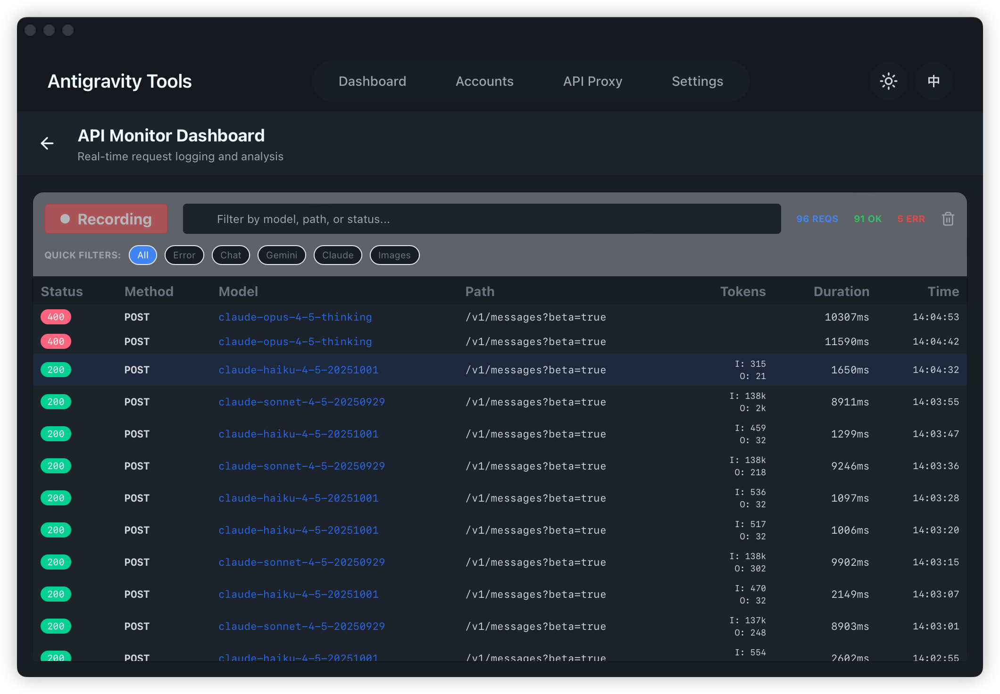
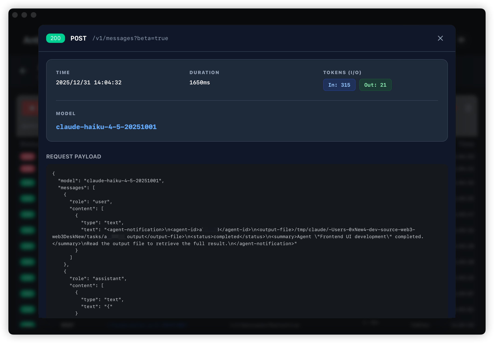

# Proxy Monitor Technical Reference

This document provides a detailed technical overview of the Proxy Monitor feature in Antigravity Manager, covering its implementation, data structures, and usage.

## 1. Interface Overview

### 1.1 Entrance (API Proxy Page)
When the proxy service is running, an entry button to the monitor dashboard appears.
> 
> *Note: Button appears next to the service status indicator.*

### 1.2 Monitor Dashboard
A full-screen dashboard showing real-time traffic, including quick filters and recording controls.
> 
> *Note: Displays real-time request logs with status, model, and token usage.*

### 1.3 Request Details (Detail Modal)
Clicking on any record opens a high-contrast modal showing the full request and response payloads.
> 
> *Note: Formatted JSON view for deep analysis.*

---

## 2. System Architecture

### 2.1 Data Flow
`Client Request` -> `Axum Middleware` -> `ProxyMonitor (Internal)` -> `SQLite DB` & `Frontend (Tauri Event)`

### 2.2 Storage Implementation (Rust)
Persistence is handled via SQLite, stored in `proxy_logs.db` within the application data directory.
*   **Table**: `request_logs`
*   **Schema**:
    *   `id`: Primary Key (UUID v4)
    *   `timestamp`: Millisecond timestamp
    *   `model`: Target model ID
    *   `request_body` / `response_body`: Original JSON payloads
    *   `input_tokens` / `output_tokens`: Token usage statistics

### 2.3 SSE Interception Algorithm
To ensure the "typewriter effect" of AI responses remains smooth, the middleware uses a non-destructive stream wrapper:
1.  Wraps the response body using `Body::into_data_stream`.
2.  Buffers the last 8KB of data as it passes through.
3.  Upon stream completion, parses the tail buffer for the SSE `data: ` block containing `usage` info.
4.  Writes to the database asynchronously to avoid blocking the HTTP response.

---

## 3. Performance & Privacy

*   **Zero-Overhead Mode**: When the "Recording" toggle is off, the middleware bypasses all processing via an atomic check.
*   **Local Only**: All logs are stored locally on the user's machine; no data is sent to external servers.
*   **Buffer Limits**: Requests are capped at 1MB and responses at 512KB to prevent memory exhaustion (OOM).
